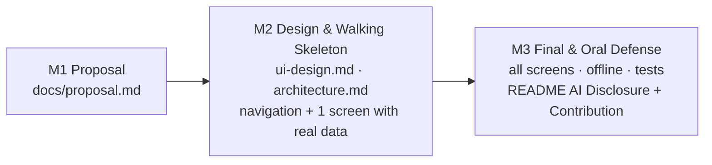

# Getting Started

> This file explains **how to use this starter**. It is not part of your deliverable — your project report is [`README.md`](README.md).
> Rules and grading: [`INSTRUCTION.md`](INSTRUCTION.md).

---

## 1. Prerequisites

| Tool | Needed for |
|------|-----------|
| [Git](https://git-scm.com/downloads) | everything |
| [Docker Desktop](https://docs.docker.com/get-docker/) | the mock API in `backend/` (skip if you build your own backend) |
| The SDK of your chosen framework | e.g., Node.js LTS + Expo, Flutter SDK, Android Studio, Xcode |
| An emulator/simulator or a physical device | running the app |
| An AI coding assistant (optional) | see [`.ai/ai-guide.md`](.ai/ai-guide.md) |

---

## 2. Create Your Team Repository

The public starter is the **template source**; your team works in a **private repository** in the course organization
announced on the LMS. Never push project work to a public repository.

### 2.1 Every member: star and fork the starter

Open https://github.com/hungdn1701/mobile-app-starter, click **⭐ Star**, then **Fork** (into your personal account).
Your fork stays public and untouched — it is only your bookmark of the starter and an easy way to see updates.
Do **not** commit project work to it.

### 2.2 One member: create the team's private repository

1. Get an **empty private repository** for your team in the course organization, as announced on the LMS
   (no README, no `.gitignore`, no license — completely empty). Ask the instructor if you lack permission to create it.
2. Copy the starter into it **with its history**:

```bash
git clone https://github.com/hungdn1701/mobile-app-starter.git <team-repo>
cd <team-repo>
git remote rename origin upstream          # the starter, for future updates
git remote add origin https://github.com/<course-org>/<team-repo>.git
git push -u origin main
```

> No command line? Use GitHub's **Import repository** (`+` → *Import repository*) with source `https://github.com/hungdn1701/mobile-app-starter.git`,
> choosing the course organization as owner and **Private** visibility.

3. In the repository settings, give your teammates **Write** access (if the organization does not already).

### 2.3 Every member: clone the team repository

```bash
git clone https://github.com/<course-org>/<team-repo>.git
cd <team-repo>
git remote add upstream https://github.com/hungdn1701/mobile-app-starter.git    # optional, to receive starter updates
make init                            # or: cp .env.example .env
```

In the first week, fill in the **Team** table and **Problem & Idea** section of `README.md`.

### 2.4 Getting starter updates

When the instructor announces an update (new version in `INSTRUCTION.md`), one member runs:

```bash
git pull upstream main     # resolve conflicts if any, then
git push
```

Keep the `LICENSE` file and the "Based on …" line at the bottom of `README.md`.

---

## 3. Mock Backend

`backend/` runs [json-server](https://github.com/typicode/json-server) (v0.17) over `backend/db.json`:
every top-level key becomes a REST resource with full CRUD.

```bash
make api-up      # start on http://localhost:3000
make api-logs    # watch requests from your app
make api-down    # stop
```

- **Adapt `backend/db.json` to your domain** — the sample data (users, products, posts, orders, ...) is only an example.
- Useful query features: `?_page=1&_limit=10` (pagination), `?q=keyword` (full-text search),
  `?_sort=price&_order=desc`, `?categoryId=1` (filter), `?_embed=comments` (relations).
- Write requests (`POST/PUT/PATCH/DELETE`) modify `backend/db.json` itself. To restore the original data:
  `git checkout backend/db.json && make api-reset`.
- You may replace the mock with your own backend; document how to run it in the README.

### Reaching the API from the app

`localhost` on an emulator or phone means **the device itself**, not your computer.

| App runs on | Base URL |
|-------------|----------|
| Android emulator | `http://10.0.2.2:3000` |
| iOS simulator | `http://localhost:3000` |
| Physical device on the same Wi-Fi | `http://<computer-LAN-IP>:3000` |
| Android device via USB | run `adb reverse tcp:3000 tcp:3000`, then `http://localhost:3000` |

Android blocks plain HTTP by default — allow cleartext traffic for development only.
The root `.env` configures Docker, **not** your app; use your framework's configuration mechanism for the base URL.

---

## 4. Create the App in `app/`

Create the project **inside `app/`** with your framework's official tooling, for example:

| Framework | Create |
|-----------|--------|
| React Native (Expo) | `cd app && npx create-expo-app@latest .` |
| Flutter | `cd app && flutter create .` |
| Kotlin + Jetpack Compose | Android Studio → New Project → save location `app/` |
| Swift + SwiftUI | Xcode → New Project → save in `app/` |

Check the framework's current documentation for the recommended template and libraries — they change often.
Make sure build outputs (`node_modules/`, `build/`, `.gradle/`, `.dart_tool/`, `Pods/`, ...) are ignored by git.

---

## 5. Workflow by Milestone



| Milestone | Checklist |
|-----------|-----------|
| **M1 — Proposal** | ☐ Team table + pitch in README ☐ `docs/proposal.md` complete ☐ ownership plan agreed |
| **M2 — Design & Skeleton** | ☐ `docs/ui-design.md` (flows, screens, wireframes, tokens, UI states) ☐ `docs/architecture.md` (layers, state, data flow, offline) ☐ app runs with navigation between main screens ☐ one screen loads data through View → ViewModel → Repository → API |
| **M3 — Final** | ☐ all screens & flows ☐ four UI states ☐ offline data ☐ tests in `docs/testing-guide.md` ☐ README complete |

**Log AI usage as you go** in [`docs/ai-log.md`](docs/ai-log.md) — two minutes after each significant session is far easier than reconstructing it the night before the deadline.

---

## 6. Team Git Workflow

```
main  ← merge via Pull Requests only
 ├── feature/expense-list      (member 1)
 ├── feature/offline-cache     (member 2)
 └── feature/settings-screen   (member 3)
```

1. `git checkout -b feature/<short-name>`
2. Commit small and often, with meaningful messages, **from your own account**.
3. Open a Pull Request — the PR template asks how you tested it and whether AI was used.
4. Another member reviews, then merge.

Split work by **feature** (screen → ViewModel → repository) rather than by layer, so each member can explain a complete slice in the oral defense.

---

## Submission Checklist

Before the deadline:

- [ ] **README:** Team, Problem & Idea, screenshots, Architecture, Quick Start, Test evidence — filled in, no template placeholders left.
- [ ] **AI Disclosure** (README §8) and [`docs/ai-log.md`](docs/ai-log.md) complete.
- [ ] **Contribution** table complete and **confirmed by every member**.
- [ ] `docs/proposal.md`, `docs/ui-design.md`, `docs/architecture.md`, `docs/api-integration.md`, `docs/testing-guide.md` complete and consistent with the app.
- [ ] App builds from a clean clone following the README; backend starts with `make api-up` (or documented alternative).
- [ ] Every data screen handles Loading / Success / Empty / Error with retry.
- [ ] Offline data works in airplane mode.
- [ ] No hard-coded base URLs or secrets; no build artifacts committed.
- [ ] Every member can explain every part they claim — see the self-check in [`.ai/ai-guide.md`](.ai/ai-guide.md#4-prepare-for-the-oral-defense).
