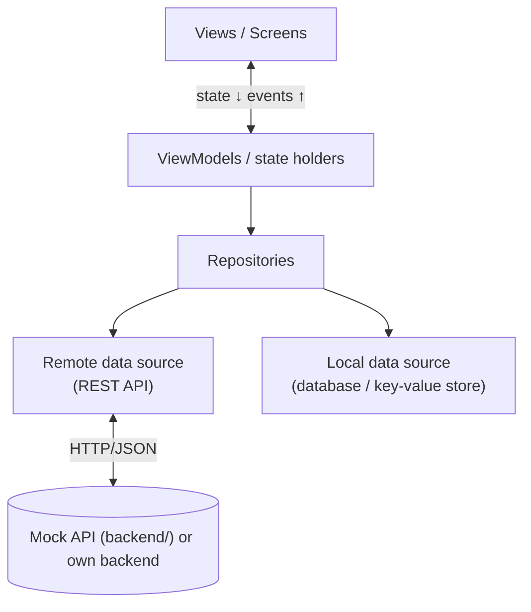

# Project Name

> **Course:** Mobile Application Development (INT1449) · PTIT · Instructor: Dr. Hung N. Dang
>
> *One-sentence pitch: what your app does and for whom.*

📜 Assignment brief & grading: [`INSTRUCTION.md`](INSTRUCTION.md) · 🚀 Setup & workflow: [`GETTING_STARTED.md`](GETTING_STARTED.md)

> **Template note:** replace every *(italic placeholder)* below. Sections marked **(mandatory)** are required for grading.

---

## 1. Team (mandatory)

| # | Full name | Student ID | Class | GitHub | Role |
|:-:|-----------|:----------:|:-----:|--------|------|
| 1 | | | | @ | |
| 2 | | | | @ | |
| 3 | | | | @ | |

**Topic:** *(e.g., Offline-first personal expense tracker)*

---

## 2. Problem & Idea (mandatory)

- **Problem:** *(What problem are you solving? Who has it?)*
- **Our idea:** *(Your solution in 2–3 sentences.)*
- **Target users:** *(Who, and in what situation do they use the app?)*
- **What makes it non-trivial:** *(e.g., offline sync, a complex multi-step flow, large lists, notifications.)*
- **Out of scope:** *(What you deliberately do not build.)*

Full proposal: [`docs/proposal.md`](docs/proposal.md)

---

## 3. Screenshots & Features

| *(Screen 1)* | *(Screen 2)* | *(Screen 3)* | *(Screen 4)* |
|:---:|:---:|:---:|:---:|
| *(image)* | *(image)* | *(image)* | *(image)* |

*(Put images in `docs/asset/` and reference them, e.g. ``.)*

- [ ] **Feature A:** *(short description)*
- [ ] **Feature B:** *(short description)*
- [ ] **Offline:** *(which data is available without network)*
- [ ] **UI states:** Loading / Success / Empty / Error with retry on every data screen

---

## 4. Architecture



| Aspect | Our choice | Why (one line) |
|--------|-----------|----------------|
| Framework | | |
| State management | | |
| HTTP client | | |
| Local storage | | |

Details: [`docs/architecture.md`](docs/architecture.md) · UI/UX: [`docs/ui-design.md`](docs/ui-design.md)

---

## 5. Quick Start

```bash
make init && make api-up      # start the mock API on http://localhost:3000 (skip if you use your own backend)
cd app
# framework-specific install & run, e.g.:  npm install && npx expo start   |   flutter run
```

| Run target | API base URL |
|------------|--------------|
| Android emulator | `http://10.0.2.2:3000` |
| iOS simulator | `http://localhost:3000` |
| Physical device | `http://<computer-LAN-IP>:3000` |

*(Describe where the base URL is configured in your app and any other setup step.)*

---

## 6. Test Evidence

*(Results for: airplane mode, slow/failed requests, empty data, rotation, different screen sizes.
Full results: [`docs/testing-guide.md`](docs/testing-guide.md).)*

---

## 7. Documentation

| Document | Content |
|----------|---------|
| [`docs/proposal.md`](docs/proposal.md) | M1 — problem, idea, scope, plan |
| [`docs/ui-design.md`](docs/ui-design.md) | Users, flows, screens, wireframes, design tokens |
| [`docs/architecture.md`](docs/architecture.md) | Layers, state management, data flow, offline strategy |
| [`docs/api-integration.md`](docs/api-integration.md) | API contract and error handling |
| [`docs/testing-guide.md`](docs/testing-guide.md) | Test methods and our test evidence |
| [`docs/ai-log.md`](docs/ai-log.md) | AI usage log |

---

## 8. AI Disclosure (mandatory)

> Policy: [`INSTRUCTION.md` §7](INSTRUCTION.md#7-ai-usage-policy). Disclosing AI use never lowers your score — hiding it does.

### 8.1 Summary

| Tool / model | Used by | Used for | Files / modules | Level |
|--------------|---------|----------|-----------------|-------|
| *(e.g., Claude)* | *(member)* | *(e.g., generate list screen, review offline cache)* | *(paths)* | *(Assist / Co-write / Generated)* |

**Levels:** **Assist** — explanations, suggestions, review; we wrote the code. **Co-write** — AI drafted parts, we
substantially rewrote. **Generated** — AI wrote most of it; we reviewed, tested and can explain it.

### 8.2 Decisions we made ourselves

*(Key design decisions made by the team, possibly after comparing AI-suggested options. E.g., "Kept a single
source of truth in the local database and refresh it from the API, because users mostly open the app offline.")*

### 8.3 Where AI was wrong — and how we found out

*(At least one concrete example: a bug, wrong assumption or bad design from AI, and how you detected and fixed it.)*

### 8.4 Full log

See [`docs/ai-log.md`](docs/ai-log.md).

---

## 9. Contribution (mandatory)

| Member | Owns (modules / documents) | Key PRs / commits | AI-assisted parts | Contribution % |
|--------|----------------------------|-------------------|-------------------|:--------------:|
| | *(e.g., Expenses feature: screen → ViewModel → repository; `docs/ui-design.md`)* | *(e.g., #3, #7)* | *(e.g., chart widget — Generated)* | |
| | | | | |
| | | | | |

We confirm the table above is accurate and agreed by all members:

- [ ] Member 1
- [ ] Member 2
- [ ] Member 3

---

<sub>Based on the [mobile-app-starter](https://github.com/hungdn1701/mobile-app-starter) template by Hung N. Dang.</sub>
