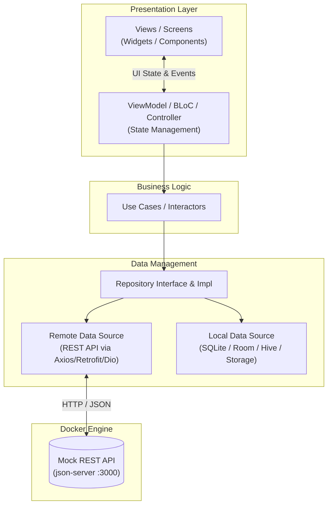

# Mẫu Đồ án: Phát triển Ứng dụng cho Thiết bị Di động (INT1449)

[](https://github.com/hungdn1701/mobile-app-starter/stargazers)
[](https://github.com/hungdn1701/mobile-app-starter/network/members)
[](LICENSE)

> **Môn học**: Phát triển ứng dụng cho thiết bị di động (INT1449)  
> **Giảng viên**: Hung N. Dang (Đặng Ngọc Hùng) — PTIT  
> **Template**: Technology-Agnostic · Mobile Best Practices · Mock Backend Included · AI-Assisted

Kho mã nguồn mẫu (starter repository) dành cho bài tập lớn / đồ án môn **Phát triển ứng dụng cho thiết bị di động (INT1449)**.
Template này được thiết kế theo các quy chuẩn thực tế trong phát triển ứng dụng di động:
hỗ trợ tự do lựa chọn framework (React Native / Expo, Flutter, Kotlin Jetpack Compose, Swift),
tích hợp sẵn dịch vụ Mock REST API qua Docker, và cấu hình tối ưu cho các trợ lý AI (Gemini, Claude, Cursor, Copilot, Windsurf).

> 📖 **Lần đầu sử dụng repo này?** Xem [`GETTING_STARTED.md`](GETTING_STARTED.md) để biết hướng dẫn fork, khởi tạo framework, kết nối Mock API, và checklist nộp bài.

---

## 👥 Danh sách sinh viên thực hiện

| STT | Họ và tên | Mã sinh viên | Lớp | Vai trò | Tỷ lệ đóng góp |
|:---:|---|:---:|:---:|---|:---:|
| 1 | Nguyễn Văn A (Trưởng nhóm) | B22DCCN001 | D22CQCN01-B | UI/UX Design, Presentation Layer | 50% |
| 2 | Trần Thị B | B22DCCN002 | D22CQCN01-B | Data Layer, API Integration, SQLite | 50% |

---

## 📱 Giới thiệu Ứng dụng & Đối tượng người dùng

*(Mô tả từ 1–2 đoạn văn: Tên ứng dụng của nhóm? Ứng dụng giải quyết nhu cầu gì? Ai là đối tượng sử dụng chính? Ví dụ: Ứng dụng theo dõi chi tiêu cá nhân, Ứng dụng đặt đồ ăn nhanh, Ứng dụng quản lý lịch học và điểm danh, v.v.)*

### 📸 Ảnh chụp màn hình (Screenshots)

*(Đính kèm hình ảnh chụp màn hình ứng dụng từ Emulator/Thiết bị thật)*

| Màn hình Đăng nhập | Màn hình Trang chủ | Màn hình Chi tiết |
|:---:|:---:|:---:|
| *(Chèn ảnh)* | *(Chèn ảnh)* | *(Chèn ảnh)* |

---

## ✨ Các tính năng chính

- [x] **Xác thực người dùng**: Đăng nhập, đăng ký, lưu trữ phiên (JWT token an toàn).
- [ ] **Hiển thị danh sách & Tìm kiếm**: Danh sách sản phẩm/tin tức với Pull-to-refresh và Phân trang (Infinite Scroll).
- [ ] **Xem chi tiết & Thao tác nghiệp vụ**: *(Mô tả ngắn tính năng cốt lõi)*.
- [ ] **Lưu trữ dữ liệu cục bộ (Offline-First)**: Lưu bài viết yêu thích / dữ liệu offline bằng SQLite / Room / Hive / AsyncStorage.
- [ ] **Trải nghiệm UI/UX nhất quán**: Xử lý đầy đủ 4 trạng thái: Loading Skeleton, Empty State, Error State, và Success State.

---

## 🏗 Kiến trúc ứng dụng (MVVM & Clean Architecture)

Ứng dụng tuân theo mô hình phân lớp rõ ràng:



Chi tiết tài liệu thiết kế UI/UX xem tại [`docs/ui-design.md`](docs/ui-design.md) và kiến trúc tại [`docs/architecture.md`](docs/architecture.md).

---

## 🚀 Khởi chạy nhanh

### 1. Khởi động Mock Backend (Cung cấp API cho App)
```bash
# Khởi tạo file cấu hình môi trường (.env)
make init

# Chạy Mock API Server
make api-up
# Mock API lắng nghe tại http://localhost:3000
```

### 2. Khởi tạo & Chạy Mobile App trong thư mục `app/`
Vào thư mục `app/` và chạy framework bạn đã chọn (xem hướng dẫn chi tiết tại [`GETTING_STARTED.md`](GETTING_STARTED.md)):
- **React Native (Expo)**: `npx expo start`
- **Flutter**: `flutter run`
- **Android Studio**: Mở thư mục `app/` và bấm Run

---

## 📂 Cấu trúc thư mục

```
mobile-app-starter/
├── README.md                  # Tài liệu tổng quan (sinh viên cập nhật khi nộp)
├── GETTING_STARTED.md         # Hướng dẫn chi tiết thiết lập framework & kết nối API
├── Makefile                   # Lệnh tiện ích điều khiển Mock API
├── docker-compose.yml         # Container hóa dịch vụ Mock REST API
├── .env.example               # Mẫu cấu hình URL API, Port
│
├── app/                       # Mã nguồn ứng dụng Di động (Technology-Agnostic)
│   ├── README.md              # Hướng dẫn khởi tạo framework trong app/
│   └── src/                   # Mã nguồn chính (Views, ViewModels, Repositories)
│
├── backend/                   # Dịch vụ Mock Backend (REST API giả lập)
│   ├── Dockerfile
│   ├── db.json                # Dữ liệu JSON mẫu (Users, Posts, Products, Comments)
│   └── README.md
│
├── docs/                      # Tài liệu đồ án
│   ├── ui-design.md           # Thiết kế User Flow, Wireframes, Design Tokens
│   ├── architecture.md        # Hướng dẫn MVVM, Clean Architecture & State Flow
│   ├── api-integration.md     # Hướng dẫn kết nối REST API, Auth, Offline caching
│   ├── testing-guide.md       # Hướng dẫn Unit Test & UI Testing
│   └── asset/
│       └── wireframes/        # Nơi lưu trữ ảnh phác thảo giao diện
│
├── .ai/                       # Cấu hình AI Coding Assistants
│   ├── AGENTS.md              # Source of truth cho AI agents
│   ├── vibe-coding-guide.md   # Hướng dẫn vibe coding di động hiệu quả
│   └── prompts/               # Prompt mẫu (tạo màn hình, tích hợp API, lưu trữ offline)
│
└── .devcontainer/             # DevContainer cho VS Code / GitHub Codespaces
```
