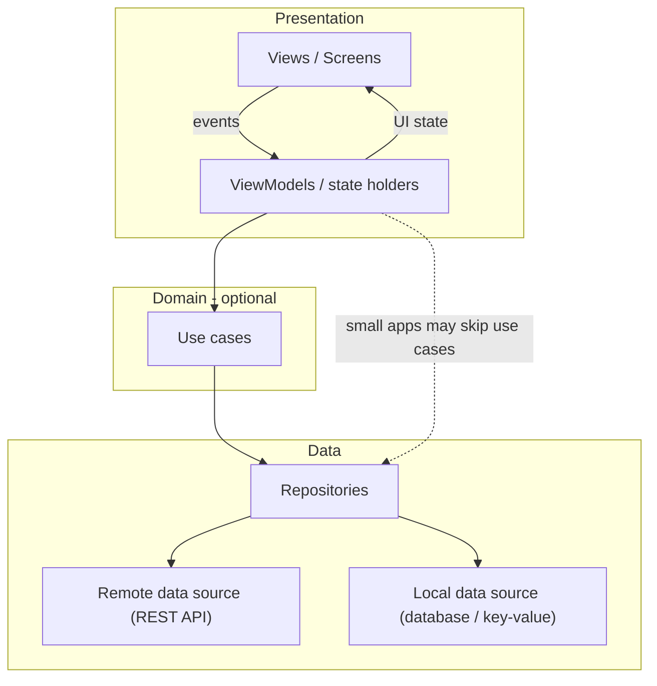
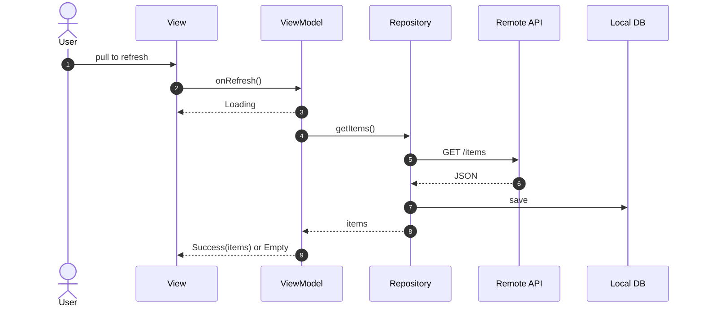
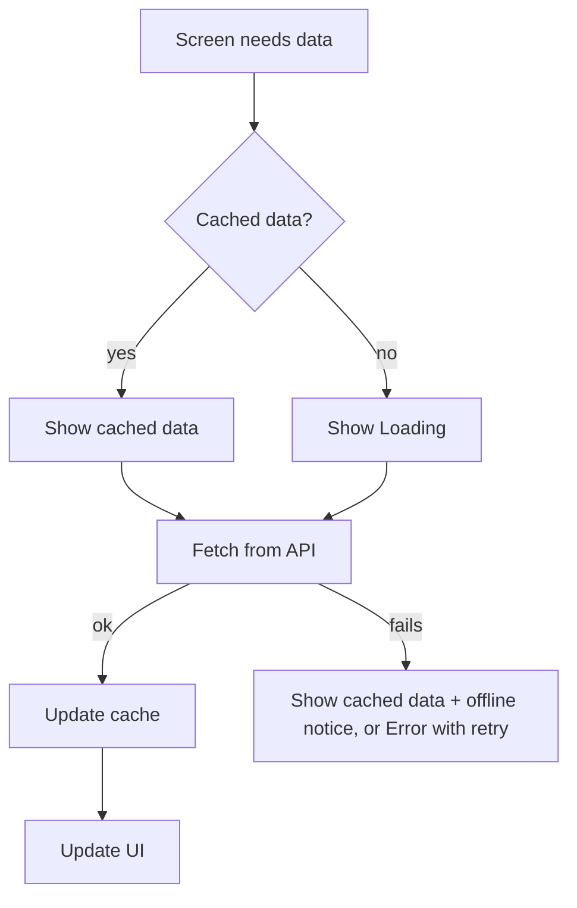

# App Architecture

> Graded under **A3 — Architecture & Data Design**. Explain **what** you built and **why**.
> The diagrams below are a reference design — replace them with your own.

---

## 1. Layers

Keep screens thin: they render state and forward user events. Logic and data access live in lower layers.



| Layer | Our implementation (folders / main classes) | Owner (member) |
|-------|---------------------------------------------|----------------|
| Presentation | | |
| Domain (if any) | | |
| Data | | |

---

## 2. State Management

**Our choice:** *(e.g., ViewModel + StateFlow, BLoC, Riverpod, Zustand, TanStack Query, @Observable, ...)*

**Why:** *(what it gives you for this app, and what you rejected)*

How is a screen's UI state modelled? Example:

```text
UiState = Loading | Success(data) | Empty | Error(message, canRetry)
```

---

## 3. Data Flow

Show one important flow end-to-end (events up, state down). Example:



---

## 4. Offline Strategy

| Data | Stored where | Read policy | Write policy | Conflict handling |
|------|--------------|-------------|--------------|-------------------|
| *(e.g., item list)* | *(e.g., SQLite)* | *(e.g., show cache, refresh in background)* | | |



*(Replace with your strategy. If your app stores sessions or other sensitive data, say where and how it is protected.)*

---

## 5. Project Structure

```text
app/
└── ...   (show your actual folder structure and what goes where)
```

---

## 6. Design Decisions

| Decision | Alternatives considered | Why we chose this |
|----------|------------------------|-------------------|
| | | |
