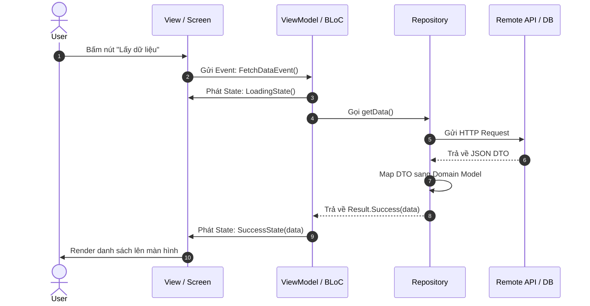
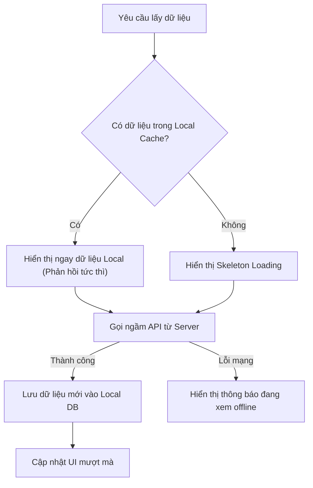

# Hướng dẫn Kiến trúc Ứng dụng Di động (Mobile Architecture Guide)

> 📌 **Tài liệu đồ án môn học**: Phát triển ứng dụng cho thiết bị di động (INT1449)

---

## 1. Mô hình Kiến trúc MVVM & Clean Architecture

Để ứng dụng dễ mở rộng, dễ kiểm thử và tránh mã nguồn bị dồn ứ toàn bộ vào file màn hình (God Activity / Giant Component), dự án cần tuân thủ cấu trúc phân lớp:

```mermaid
graph TD
    subgraph Presentation Layer
        UI["UI Components / Screens\n(Compose / Flutter Widgets / React Components)"]
        VM["ViewModel / BLoC / Store\n(State Holder & Event Handler)"]
        UI -->|User Events / Actions| VM
        VM -->|UI State (Flow / Stream / Observable)| UI
    end

    subgraph Domain Layer
        UC["Use Cases / Interactors\n(Thuần Logic nghiệp vụ, không phụ thuộc Framework)"]
        VM --> UC
    end

    subgraph Data Layer
        REPO["Repository (Single Source of Truth)"]
        UC --> REPO
        REMOTE["Remote DataSource\n(REST API Client)"]
        LOCAL["Local DataSource\n(SQLite / Room / Hive / Storage)"]
        REPO --> REMOTE
        REPO --> LOCAL
    end
```

---

## 2. Luồng Dữ liệu Một chiều (Unidirectional Data Flow - UDF)

Nguyên tắc vàng trong phát triển UI hiện đại: **Dữ liệu đi xuống, Sự kiện đi lên**.



---

## 3. Quản lý Trạng thái (State Management Matrix)

Tùy thuộc vào framework bạn chọn, hãy lựa chọn giải pháp quản lý trạng thái phù hợp:

| Framework | Khuyến nghị cho dự án | Cơ chế cốt lõi |
|---|---|---|
| **React Native** | **Zustand** hoặc **TanStack Query** (React Query) | Store đơn giản / Quản lý cache API tự động |
| **Flutter** | **BLoC** (flutter_bloc) hoặc **Riverpod** / **Provider** | Stream-based State Machine / Dependency Injection |
| **Kotlin (Android)** | **Jetpack ViewModel + StateFlow** | Reactive Coroutine Flow gắn với Lifecycle |
| **Swift (iOS)** | **ObservableObject / @Observable (Swift 5.9+)** | Combine / Swift Concurrency |

---

## 4. Chiến lược Ngoại tuyến (Offline-First Strategy)

Ứng dụng di động cần hoạt động đáng tin cậy ngay cả khi mất mạng hoặc kết nối chập chờn:



### Công nghệ lưu trữ cục bộ:
- Dữ liệu cấu trúc lớn: **SQLite** (qua Room trên Android, sqflite/drift trên Flutter, expo-sqlite trên React Native).
- Dữ liệu cặp khóa-giá trị (Cài đặt, Flag): **SharedPreferences / DataStore** (Android), **UserDefaults** (iOS), **MMKV / AsyncStorage** (React Native).
- Khóa bảo mật & Token: **EncryptedSharedPreferences / Keychain / Expo SecureStore**.
