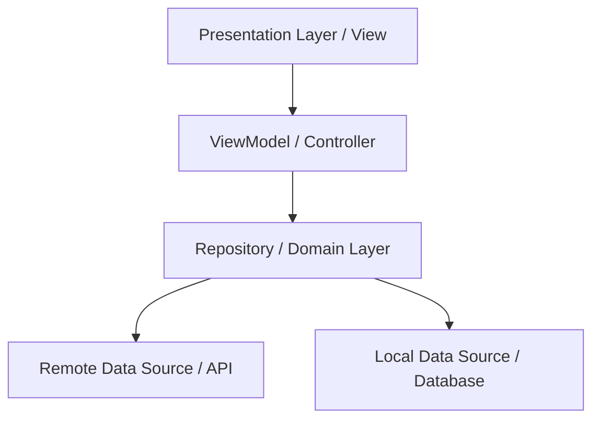

# 🏗️ Mobile Architecture

## 📌 Tổng quan
Dự án áp dụng kiến trúc nhằm tách biệt rõ ràng giữa giao diện người dùng và logic nghiệp vụ. Khuyến Phần lớn các ứng dụng sẽ sử dụng **MVVM (Model-View-ViewModel)** hoặc **Clean Architecture**.

## 🏛️ Lớp kiến trúc (Layers)

1. **Presentation Layer (View):** Chứa các màn hình (Screens), Components và xử lý UI events. Chỉ hiển thị dữ liệu từ ViewModel, không chứa logic lấy dữ liệu.
2. **ViewModel (State Management):** Chứa State của ứng dụng. Nhận sự kiện từ View, gọi Repository để xử lý dữ liệu và cập nhật lại State cho View.
3. **Repository (Domain Layer):** Đóng vai trò làm trung gian phân phối dữ liệu (Single Source of Truth). Quyết định lấy dữ liệu từ API hay từ Local Database.
4. **Data Layer (Data Source):**
   - **Remote:** Xử lý các HTTP Request (REST API).
   - **Local:** Lưu trữ cục bộ (SQLite, Room, CoreData, SharedPreferences, AsyncStorage).

## 💉 Dependency Injection
(Nếu có sử dụng, mô tả cách tiêm phụ thuộc trong ứng dụng. Ví dụ: sử dụng `get_it` trong Flutter, hay Hilt trong Android, Swinject trong iOS).
