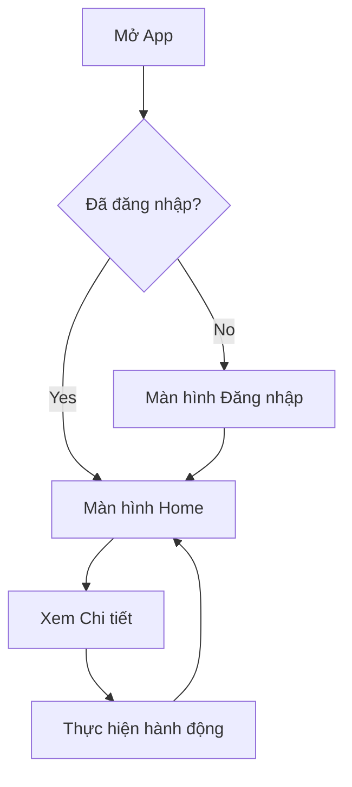

# 🎨 UI/UX Design

## 📱 App Overview
(Mô tả tổng quan về ứng dụng từ góc độ người dùng. Giao diện chính là gì? Cảm giác mang lại là gì?)

## 🎯 Target Users
(Đối tượng người dùng mục tiêu. Độ tuổi, thói quen sử dụng, kỹ năng công nghệ.)

## 🔄 User Flow
Luồng người dùng cơ bản của ứng dụng:

## 🖼️ Wireframes
(Chèn ảnh wireframe hoặc mockup thiết kế giao diện tại đây. Lưu ảnh trong thư mục `docs/asset/wireframes/`)

## 🎨 Color Scheme & Typography
- **Primary Color:** `#000000` (Đen)
- **Secondary Color:** `#FFFFFF` (Trắng)
- **Accent Color:** `#007BFF` (Xanh lam)
- **Font:** Roboto / San Francisco

## 🧩 Component Library
Các thành phần giao diện được sử dụng chung:
- **Buttons:** Primary Button, Secondary Button, Outline Button.
- **Inputs:** Text Field, Password Field, Search Bar.
- **Cards:** Item Card, User Profile Card.
