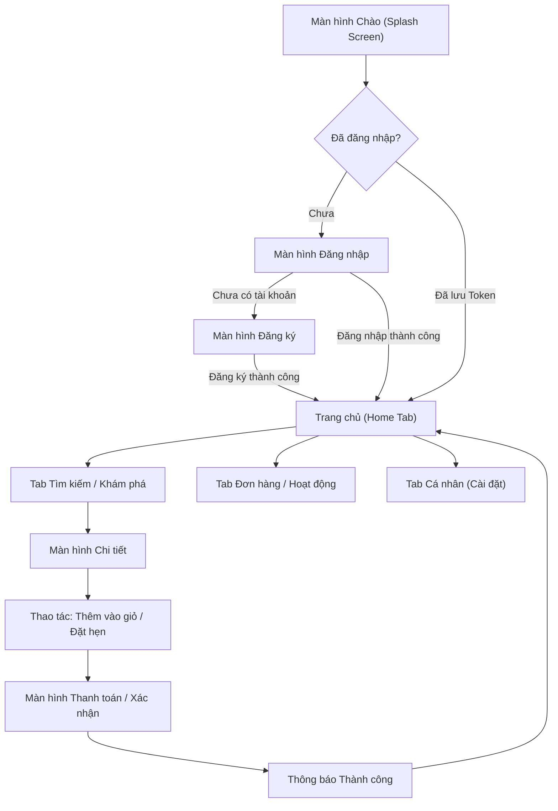

# Thiết kế Giao diện & Trải nghiệm Người dùng (UI/UX Design Specification)

> 📌 **Tài liệu đồ án môn học**: Phát triển ứng dụng cho thiết bị di động (INT1449)  
> Sinh viên cần hoàn thiện tài liệu này để định hình rõ toàn bộ màn hình, luồng thao tác và bảng màu trước khi lập trình.

---

## 1. Mục tiêu & Chân dung Người dùng (User Personas)

### 1.1. Mục tiêu sản phẩm
- Giải quyết bài toán: *(Ví dụ: Giúp sinh viên quản lý thời gian biểu và nhắc hẹn nộp bài tập)*
- Giá trị mang lại: *(Giao diện tối giản, truy cập nhanh dưới 3 lần chạm, hoạt động mượt mà kể cả khi không có kết nối mạng)*

### 1.2. Chân dung người dùng mục tiêu
| Tiêu chí | Mô tả |
|---|---|
| **Độ tuổi** | 18 – 24 tuổi (Sinh viên đại học) |
| **Thói quen sử dụng** | Dùng smartphone liên tục, ưa chuộng thao tác vuốt (gesture), thích Dark Mode |
| **Nỗi đau (Pain points)** | Hay quên lịch thi/hạn nộp bài, ứng dụng hiện tại tải chậm, quảng cáo nhiều |

---

## 2. Luồng Người dùng (User Flows)

Vẽ sơ đồ luồng thao tác chính của người dùng từ lúc mở app đến khi hoàn tất hành động:

---

## 3. Danh mục Màn hình & Điều hướng (Screen Inventory)

| Mã màn hình | Tên màn hình | Mục đích & Chức năng | Thành phần chính |
|:---:|---|---|---|
| `SCR-01` | **Splash / Onboarding** | Giới thiệu app và điều hướng phiên | Logo, Nút Bắt đầu |
| `SCR-02` | **Login / Register** | Xác thực tài khoản | Form Input, Validation, OAuth button |
| `SCR-03` | **Home Feed** | Hiển thị nội dung tổng quan, Banner | Carousel, Danh sách danh mục, Grid sản phẩm |
| `SCR-04` | **Search & Filter** | Tìm kiếm dữ liệu theo từ khóa | Search bar, Filter chip, Infinite list |
| `SCR-05` | **Detail Screen** | Xem chi tiết một đối tượng cụ thể | Image gallery, Mô tả chi tiết, Nút hành động |
| `SCR-06` | **Profile & Settings**| Quản lý thông tin cá nhân, Đổi theme | Avatar, Switch Dark mode, Nút Đăng xuất |

---

## 4. Bảng Quy chuẩn Thiết kế (Design Tokens)

### 4.1. Bảng màu (Color Palette)
- **Primary Color**: `#1E40AF` (Xanh chủ đạo - thể hiện sự tin cậy)
- **Secondary / Accent**: `#F59E0B` (Vàng cam - nút hành động quan trọng)
- **Background (Light)**: `#F8FAFC`
- **Background (Dark)**: `#0F172A`
- **Surface / Card**: `#FFFFFF` (Light) / `#1E293B` (Dark)
- **Text Primary**: `#0F172A` (Light) / `#F8FAFC` (Dark)
- **Error / Danger**: `#EF4444`
- **Success**: `#10B981`

### 4.2. Typography
- **Font gia đình**: Inter / Roboto / SF Pro Display
- **Tiêu đề lớn (H1)**: 28sp / Semi-Bold
- **Tiêu đề màn hình (H2)**: 20sp / Medium
- **Văn bản thông thường (Body)**: 14sp / Regular
- **Ghi chú nhỏ (Caption)**: 12sp / Regular

---

## 5. Quy chuẩn 4 Trạng thái Giao diện (UI State Consistency)

Mỗi màn hình có tải dữ liệu từ API bắt buộc phải thiết kế đủ 4 trạng thái:

1. **Loading State**: Hiển thị Shimmer Skeleton hoặc Activity Indicator nhẹ nhàng, tránh làm giật layout.
2. **Success State**: Dữ liệu hiển thị trực quan, có hỗ trợ Pull-to-refresh để làm mới.
3. **Empty State**: Khi danh sách rỗng, hiển thị hình minh họa thân thiện kèm gợi ý hành động (ví dụ: *"Chưa có bài viết nào - Bấm đây để tạo bài đầu tiên"*).
4. **Error State**: Khi mất kết nối hoặc server lỗi, hiển thị thông báo dễ hiểu kèm nút **Thử lại (Retry)**.

---

## 6. Phác thảo Giao diện (Wireframes)

*(Nhóm có thể đính kèm link Figma thiết kế hoặc lưu các ảnh phác thảo wireframe vẽ tay vào thư mục `docs/asset/wireframes/` và dẫn liên kết vào đây)*

- [Xem bản thiết kế Figma (nếu có)](https://figma.com)
- Ảnh phác thảo màn hình chính: `docs/asset/wireframes/home_wireframe.png`
