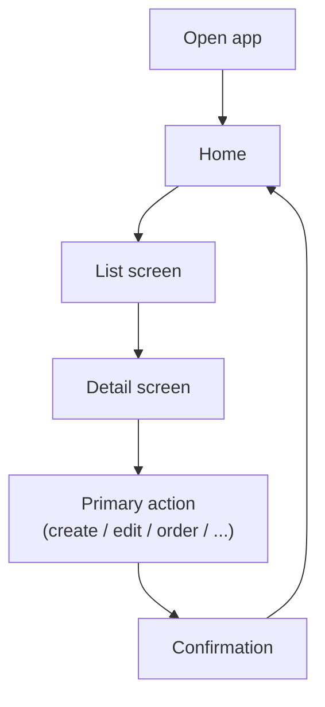

# UI/UX Design

> Complete this document before building screens (Milestone M2) and keep it in sync with the app.
> It is graded under **A2 — UI/UX Design**. The examples are illustrations — replace them with your own design.

---

## 1. Users & Goals

### 1.1 Product goal

- **Problem solved:** *(e.g., students forget assignment deadlines)*
- **Value delivered:** *(e.g., see this week's deadlines in under 3 taps, even offline)*

### 1.2 Personas

| | Persona 1 | Persona 2 |
|---|---|---|
| **Who** | | |
| **Context of use** | *(where, when, connectivity, device)* | |
| **Needs / pain points** | | |

---

## 2. User Flows

Draw the main flows from opening the app to completing each key task. Example:

*(If your app has accounts, include the sign-in / sign-up flow and what an unauthenticated user can see.)*

---

## 3. Screen Inventory

| ID | Screen | Purpose | Main components | Data source |
|:--:|--------|---------|-----------------|-------------|
| `SCR-01` | | | | |
| `SCR-02` | | | | |
| `SCR-03` | | | | |
| `SCR-04` | | | | |

---

## 4. Wireframes

Sketches (hand-drawn photos are fine) or a design-tool link. Store images in `docs/asset/wireframes/`.

- *(link to design file, if any)*
- `docs/asset/wireframes/<screen>.png`

---

## 5. Design Tokens

### 5.1 Colors

| Token | Light | Dark | Usage |
|-------|-------|------|-------|
| `primary` | | | |
| `secondary` | | | |
| `background` | | | |
| `surface` | | | |
| `text-primary` | | | |
| `error` | | | |
| `success` | | | |

### 5.2 Typography & spacing

| Token | Value | Usage |
|-------|-------|-------|
| `title` | *(e.g., 22sp semibold)* | |
| `body` | | |
| `caption` | | |
| `spacing-unit` | *(e.g., 8dp)* | |

---

## 6. UI States

For every screen that loads data, design all four states:

| Screen | Loading | Success | Empty | Error (with retry) |
|--------|---------|---------|-------|--------------------|
| *(SCR-0x)* | *(skeleton / spinner)* | | *(message + call to action)* | *(friendly message + Retry)* |

---

## 7. Accessibility & Adaptivity

- Minimum touch target, contrast, dynamic font size:
- Small screens, tablets, rotation:
- Dark mode:

---

## 8. Design Decisions

| Decision | Alternatives considered | Why we chose this |
|----------|------------------------|-------------------|
| | | |
